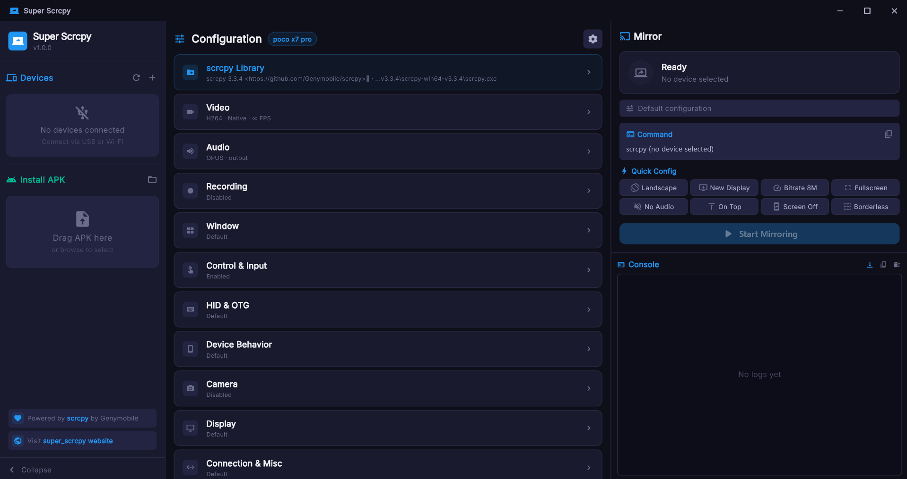

<p align="center">
  
  
  
  
  <a href="https://github.com/anandssm/super_scrcpy/actions/workflows/build.yml">
    
  </a>
  <a href="https://github.com/anandssm/super_scrcpy/releases">
    
  </a>
</p>

<h1 align="center">
  Super Scrcpy
</h1>

<p align="center">
  
</p>

<p align="center">
  <strong>An Advanced, modern GUI for <a href="https://github.com/Genymobile/scrcpy">scrcpy</a> — mirror and control your Android device from your desktop.</strong>
</p>

<p align="center">
  <em>Built with Flutter • Works on Windows, macOS & Linux</em>
</p>

---

## What is Super Scrcpy?

**Super Scrcpy** is an elegant desktop application that provides a full-featured graphical interface for [scrcpy](https://github.com/Genymobile/scrcpy), the popular open-source tool for Android screen mirroring. Instead of memorizing complex command-line flags, Super Scrcpy lets you configure everything visually — then mirrors your Android screen with a single click.

> **No more typing `scrcpy --video-codec h265 -m 1080 --max-fps 60 -b 8M --turn-screen-off --stay-awake`**
>
> Just toggle a few switches and hit **Start Mirroring**.

---

## Features

### Device Management
- **Auto-detection** of USB-connected Android devices
- **Wi-Fi (TCP/IP) connectivity** — connect wirelessly with IP address and port
- **ADB Wireless Pairing (QR)** support for Android 11+ devices
- **Multi-device support** with easy device selection from the sidebar
- **Real-time device status** indicators (online, offline, unauthorized)
- **Auto-refreshing device list** so newly connected/disconnected devices appear quickly

### Video & Display
- **Video codec selection** — H.264, H.265 (HEVC), AV1
- **Resolution & bitrate control** with preset sizes and custom values
- **Frame rate limiting** for bandwidth optimization
- **Crop region** support for mirroring specific screen areas
- **Capture orientation** — landscape, portrait, and custom angles
- **Custom video encoder** and codec options
- **Display buffer** configuration for smoother playback

### Audio
- **Full audio forwarding** from your Android device
- **Audio codec selection** — Opus, AAC, FLAC, Raw
- **Audio source switching** — device output, microphone, or playback
- **Audio bitrate** and buffer fine-tuning

### Recording
- **Screen recording** to MP4 or MKV format
- **Custom output path** selection via file picker
- Record while mirroring — no separate tool needed

### Window Management
- **Fullscreen**, **always-on-top**, and **borderless** modes
- **Custom window title**, position, and dimensions
- Configurable window placement on screen

### Control & Input
- **Full touch & keyboard control** of your Android device
- **HID keyboard & mouse** for native-level input
- **Show touches** on the mirrored display
- **Forward all clicks** for precise click behavior
- **Clipboard sync** control
- **Stay awake** while mirroring
- **Turn screen off** on device while still mirroring
- **Power off on close** — automatically turn off device display when you close scrcpy

### Camera Mirroring
- **Mirror device cameras** directly (front, back, external)
- **Camera resolution** and **aspect ratio** configuration
- **Camera FPS** control with high-speed mode

### Virtual Display
- **New display mode** — create a virtual display on your Android device
- **Custom display size** with presets (e.g., 1920x1080, 1280x720)
- **Launch specific apps** on the virtual display

### APK Installer
- **Drag & drop** APK files directly onto the sidebar to install
- **File picker** to browse and select APK files
- **Real-time install progress** and success/failure indicators

### Quick Config
- **One-click toggles** for the most common options:
  - Landscape · New Display · Bitrate 8M · Fullscreen
  - No Audio · Always on Top · Screen Off · Borderless

### Built-in Console
- **Live log output** with auto-scroll
- **Color-coded logs** — commands (cyan), errors (red), info (default)
- **Copy-ready command preview** — see the exact scrcpy command being built
- **Removable config chips** — remove any config chip to reset that option
- **Detailed wireless pairing logs** for discovery, pairing, and connect steps

### Polished UI
- **Sleek dark theme** with purple and cyan accents
- **Collapsible sidebar** for more screen space
- **Custom title bar** with native window controls
- **Smooth animations** and micro-interactions throughout
- **Responsive layout** that adapts to window size

---

## Getting Started

### Prerequisites

1. **Flutter SDK** `>= 3.10.4` — [Install Flutter](https://docs.flutter.dev/get-started/install)
2. **scrcpy** — [Download scrcpy](https://github.com/Genymobile/scrcpy#get-the-app)
3. **ADB** (Android Debug Bridge) — usually bundled with scrcpy
4. **Android device** with [USB debugging enabled](https://developer.android.com/studio/debug/dev-options)

### Installation

```bash
# 1. Clone the repository
git clone https://github.com/anandssm/super_scrcpy.git
cd super_scrcpy

# 2. Install dependencies
flutter pub get

# 3. Run the app
flutter run -d windows   # or macos / linux
```

### Building for Release

```bash
# Windows
flutter build windows --release

# macOS
flutter build macos --release

# Linux
flutter build linux --release
```

The compiled application will be in the `build/` directory.

---

## Usage

### 1. Set up scrcpy

On first launch, Super Scrcpy will try to auto-detect your scrcpy installation. If it can't find it, click the **Library** settings card and manually browse to your scrcpy folder.

### 2. Connect your device

- **USB**: Plug in your Android device with USB debugging enabled. It should appear in the sidebar automatically.
- **Wi-Fi (manual)**: Click the **+** button in the Devices panel, choose **Manual**, enter your device's IP address and port, then click **Connect**.
- **Wi-Fi (QR pairing)**: Click the **+** button, switch to **QR**, then scan the generated QR code from **Developer options > Wireless debugging > Pair device with QR code** on your phone.

### 2.1 Wireless Debugging with QR (Android 11+)

Super Scrcpy supports the modern ADB wireless pairing flow end-to-end:

1. Open **Developer options > Wireless debugging** on your Android device.
2. Tap **Pair device with QR code**.
3. In Super Scrcpy, open **Devices > + > QR**.
4. Scan the QR code shown by Super Scrcpy.
5. Wait for pairing and automatic wireless connect to complete.

After success, your device appears as a normal ADB target and can be mirrored like a USB-connected device.

> Notes:
> - Your desktop and phone must be on the same network.
> - The pairing QR/session is short-lived by design; regenerate if it expires.

### 3. Configure and mirror

1. Select your device from the sidebar
2. Adjust settings using the configuration cards (Video, Audio, Display, etc.)
3. Use **Quick Config** toggles for common options
4. Click **Start Mirroring**

### 4. Install APKs

Drag any `.apk` file onto the **Install APK** drop zone in the sidebar, or click the folder icon to browse. The APK will be installed on your selected device.

---

## Project Structure

```
super_scrcpy/
├── lib/
│   ├── main.dart                    # App entry point, window setup, title bar
│   ├── core/
│   │   ├── app_colors.dart          # Design system — color palette & gradients
│   │   ├── app_dimens.dart          # Design system — spacing, radii, breakpoints
│   │   └── app_theme.dart           # Material theme configuration
│   ├── models/
│   │   ├── adb_device.dart          # ADB device model
│   │   └── scrcpy_config.dart       # Scrcpy configuration model & CLI arg builder
│   ├── providers/
│   │   ├── scrcpy_provider.dart     # Main state management for devices and mirroring
│   │   └── settings_provider.dart   # App settings and persisted preferences
│   ├── services/
│   │   └── scrcpy_service.dart      # ADB/scrcpy process management
│   ├── screens/
│   │   ├── home/
│   │   │   ├── home_screen.dart     # Main layout (sidebar + config + mirror + console)
│   │   │   ├── unified_config_screen.dart  # Configuration cards grid
│   │   │   ├── dialogs/             # Settings dialog for each category
│   │   │   │   ├── video_settings_dialog.dart
│   │   │   │   ├── audio_settings_dialog.dart
│   │   │   │   ├── display_settings_dialog.dart
│   │   │   │   ├── camera_settings_dialog.dart
│   │   │   │   ├── window_settings_dialog.dart
│   │   │   │   ├── control_settings_dialog.dart
│   │   │   │   ├── record_settings_dialog.dart
│   │   │   │   ├── device_settings_dialog.dart
│   │   │   │   ├── hid_settings_dialog.dart
│   │   │   │   ├── misc_settings_dialog.dart
│   │   │   │   ├── library_settings_dialog.dart
│   │   │   │   └── config_dialog_helper.dart
│   │   │   └── widgets/
│   │   │       └── config_tile.dart # Reusable tile used in the config screen
│   │   └── mirror/
│   │       └── mirror_screen.dart   # Mirror panel, command preview, quick toggles
│   └── widgets/
│       ├── app_sidebar.dart         # Sidebar — devices, APK drop, about section
│       ├── settings_card.dart       # Reusable settings card component
│       ├── labeled_dropdown.dart    # Dropdown with label
│       ├── labeled_slider.dart      # Slider with label
│       ├── labeled_text_field.dart  # Text field with label
│       └── toggle_option.dart       # Toggle switch with label
├── windows/                         # Windows platform files
├── macos/                           # macOS platform files
├── linux/                           # Linux platform files
└── pubspec.yaml                     # Dependencies & project metadata
```

---

## Tech Stack

| Layer | Technology |
|---|---|
| **Framework** | [Flutter](https://flutter.dev) (Desktop) |
| **Language** | [Dart](https://dart.dev) 3.10+ |
| **State Management** | [Provider](https://pub.dev/packages/provider) (ChangeNotifier) |
| **Persistence** | [shared_preferences](https://pub.dev/packages/shared_preferences) |
| **App Directories** | [path_provider](https://pub.dev/packages/path_provider) |
| **App Metadata** | [package_info_plus](https://pub.dev/packages/package_info_plus) |
| **Adaptive Theming** | [dynamic_color](https://pub.dev/packages/dynamic_color) |
| **Typography** | [Google Fonts](https://pub.dev/packages/google_fonts) |
| **Window Management** | [window_manager](https://pub.dev/packages/window_manager) |
| **File Drag & Drop** | [desktop_drop](https://pub.dev/packages/desktop_drop) |
| **File Picker** | [file_picker](https://pub.dev/packages/file_picker) |
| **QR Rendering** | [pretty_qr_code](https://pub.dev/packages/pretty_qr_code) |
| **Process Utilities** | [process_run](https://pub.dev/packages/process_run) |
| **ADB/scrcpy Process Control** | Dart `dart:io` + [process_run](https://pub.dev/packages/process_run) |
| **SVG Support** | [flutter_svg](https://pub.dev/packages/flutter_svg) |
| **URL Launcher** | [url_launcher](https://pub.dev/packages/url_launcher) |

---

## Contributing

Contributions are welcome! Here's how you can help:

1. **Fork** the repository
2. **Create a feature branch**: `git checkout -b feature/amazing-feature`
3. **Commit your changes**: `git commit -m 'Add amazing feature'`
4. **Push to the branch**: `git push origin feature/amazing-feature`
5. **Open a Pull Request**


---

## Supported scrcpy Options

Super Scrcpy supports virtually **every scrcpy option** through its GUI, organized into logical categories:

<details>
<summary><strong>Video</strong></summary>

| Option | CLI Flag | Supported |
|---|---|:---:|
| Video Codec | `--video-codec` | ✅ |
| Max Size | `-m` | ✅ |
| Video Bitrate | `-b` | ✅ |
| Max FPS | `--max-fps` | ✅ |
| Crop | `--crop` | ✅ |
| Capture Orientation | `--capture-orientation` | ✅ |
| Video Encoder | `--encoder` | ✅ |
| Codec Options | `--codec-options` | ✅ |
| Display Buffer | `--display-buffer` | ✅ |
| Angle | `--angle` | ✅ |

</details>

<details>
<summary><strong>Audio</strong></summary>

| Option | CLI Flag | Supported |
|---|---|:---:|
| No Audio | `--no-audio` | ✅ |
| Audio Codec | `--audio-codec` | ✅ |
| Audio Bitrate | `--audio-bit-rate` | ✅ |
| Audio Source | `--audio-source` | ✅ |
| Audio Buffer | `--audio-buffer` | ✅ |

</details>

<details>
<summary><strong>Window</strong></summary>

| Option | CLI Flag | Supported |
|---|---|:---:|
| Fullscreen | `-f` | ✅ |
| Always on Top | `--always-on-top` | ✅ |
| Borderless | `--window-borderless` | ✅ |
| Window Title | `--window-title` | ✅ |
| Window Position | `--window-x`, `--window-y` | ✅ |
| Window Size | `--window-width`, `--window-height` | ✅ |

</details>

<details>
<summary><strong>Control</strong></summary>

| Option | CLI Flag | Supported |
|---|---|:---:|
| No Control | `-n` | ✅ |
| Show Touches | `-t` | ✅ |
| HID Keyboard | `-K` | ✅ |
| HID Mouse | `-M` | ✅ |
| Forward All Clicks | `--forward-all-clicks` | ✅ |
| No Clipboard Sync | `--no-clipboard-autosync` | ✅ |
| Stay Awake | `-w` | ✅ |
| Turn Screen Off | `-S` | ✅ |
| Power Off on Close | `--power-off-on-close` | ✅ |

</details>

<details>
<summary><strong>Camera and Display</strong></summary>

| Option | CLI Flag | Supported |
|---|---|:---:|
| Camera Mode | `--video-source=camera` | ✅ |
| Camera ID | `--camera-id` | ✅ |
| Camera Size | `--camera-size` | ✅ |
| Camera Facing | `--camera-facing` | ✅ |
| Camera FPS | `--camera-fps` | ✅ |
| Camera High Speed | `--camera-high-speed` | ✅ |
| New Display | `--new-display` | ✅ |
| Display ID | `--display` | ✅ |
| OTG Mode | `--otg` | ✅ |

</details>

<details>
<summary><strong>Misc</strong></summary>

| Option | CLI Flag | Supported |
|---|---|:---:|
| No Display | `--no-display` | ✅ |
| No Video | `--no-video` | ✅ |
| No Cleanup | `--no-cleanup` | ✅ |
| Disable Screensaver | `--disable-screensaver` | ✅ |
| Force ADB Forward | `--force-adb-forward` | ✅ |
| Tunnel Host/Port | `--tunnel-host`, `--tunnel-port` | ✅ |
| Log Level | `--log-level` | ✅ |
| Push Target | `--push-target` | ✅ |
| Start App | `--start-app` | ✅ |
| Recording | `-r` | ✅ |
| Record Format | `--record-format` | ✅ |

</details>

---

## License

This project is licensed under the **GNU General Public License v3.0**.

See [LICENSE](LICENSE) for the full text.

---

## Acknowledgments

- **[scrcpy](https://github.com/Genymobile/scrcpy)** by [Genymobile](https://github.com/Genymobile) — the incredible open-source tool that makes Android screen mirroring possible
- **[Flutter](https://flutter.dev)** — for making beautiful cross-platform desktop apps a reality

---

## Author

**Anand Kumar**

- GitHub: [@anandssm](https://github.com/anandssm)
- Telegram: [@hanoipprojects](https://t.me/hanoipprojects)

---

## Support

If you find Super Scrcpy useful, please consider giving it a star on GitHub. It helps others discover the project.

---

<p align="center">
  <sub>Made with Flutter</sub>
</p>
